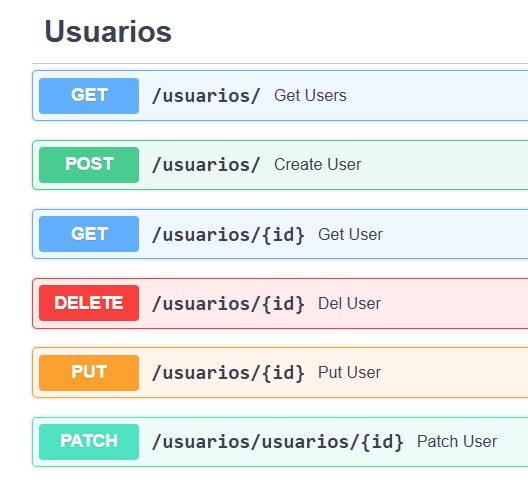

# 🔶 API REST con FastAPI

El proyecto implementa un CRUD base para mantenedor de Usuarios, siguiendo los fundamentos REST.

### ⚙️ Tecnologías:
- Python 3.13.3
- FastAPI 0.138.0
- psycopg2 2.9.12
- PostgreSQL 18.4

## 🚀 Instalación y Ejecución

Sigue estos pasos para clonar el proyecto y levantar el servidor local de desarrollo.

### Requisitos Previos
* **Python 3.10 o superior** instalado en tu sistema.
* **Git** instalado para clonar el repositorio.

### Pasos para Iniciar

1. **Clonar el repositorio:**
   ```bash
   git clone https://github.com
   cd tu-repositorio
   ```

2. **Crear el entorno virtual:**
   * En Windows:
     ```bash
     python -m venv venv
     .\venv\Scripts\activate
     ```
   * En Linux/macOS:
     ```bash
     python3 -m venv venv
     source venv/bin/activate
     ```

3. **Instalar las dependencias:**
   ```bash
   pip install --upgrade pip
   pip install -r requirements.txt
   ```

4. **Configurar las variables de entorno:**
   Crea una copia del archivo `.env.example` y nómbralo `.env`:
   * En Windows (PowerShell):
     ```powershell
     cp .env.example .env
     ```
   * En Linux/macOS o Git Bash:
     ```bash
     cp .env.example .env
     ```
   *Abre el nuevo archivo `.env` y edita los valores con tus credenciales locales reales.*

5. **Iniciar el servidor de desarrollo:**
   ```bash
   fastapi dev main.py
   ```

### 🌐 Verificar la ejecución

Una vez que el proyecto esté en ejecución, puedes acceder a la documentación interactiva generada automáticamente por FastAPI en el siguiente enlace:

* 📘 **Swagger UI (Recomendado):** [http://127.0.0.1:8000/docs](http://127.0.0.1:8000/docs) (Para probar los endpoints directamente en el navegador)

<p align="center">
  
</p>
