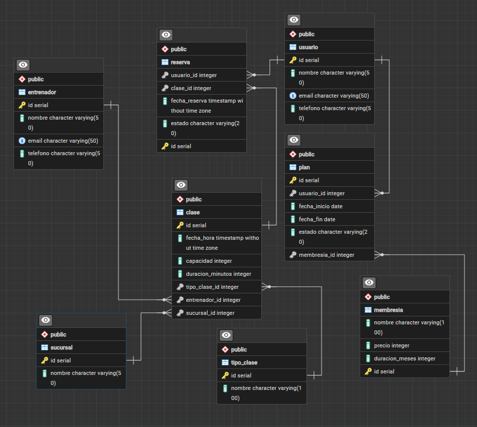
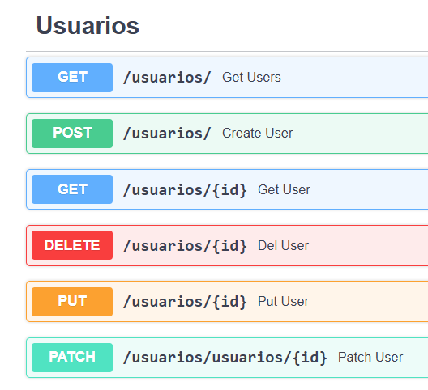

# 🔶 API REST — Sistema de Gestión de Gimnasio

API REST construida con FastAPI para la gestión integral de un gimnasio: usuarios, membresías, planes, clases, reservas, entrenadores y sucursales, siguiendo los fundamentos REST.

### ⚙️ Tecnologías

- Python 3.13.3
- FastAPI 0.138.0
- psycopg2 2.9.12
- PostgreSQL 18.4
- Docker & Docker Compose

### 📂 Estructura del Proyecto

El proyecto sigue una arquitectura modular orientada al **Patrón Repositorio**, aislando la lógica de negocio del acceso a datos para lograr un código desacoplado y testeable:

- `database/`: Configuración, conexión y manejo de sesiones con PostgreSQL.
- `exceptions/`: Manejo centralizado de errores y excepciones HTTP personalizadas.
- `routers/`: Definición de endpoints de la API (Controladores REST).
- `schemas/`: Modelos de datos y validación de peticiones con Pydantic.
- `services/`: Capa de lógica de negocio que coordina las operaciones del sistema.
- `repository/`: Capa de acceso a datos encargada de ejecutar las consultas SQL mediante psycopg2.
- `recource/`: Script SQL con el esquema completo de la base de datos.
- `test/`: Suite de tests, dividida en `unit/` (routers, services) e `integration/` (repository).
- `main.py`: Punto de entrada de la aplicación FastAPI.

### 🗂️ Modelo de datos



## 🚀 Instalación y Ejecución

Hay dos formas de levantar el proyecto: con **Docker** (recomendado, no requiere instalar PostgreSQL localmente) o de forma **manual**.

### Opción A: Con Docker (recomendado)

**Requisitos previos:**
- [Docker Desktop](https://www.docker.com/products/docker-desktop/) instalado y en ejecución.
- Git instalado para clonar el repositorio.

**Pasos:**

1. **Clonar el repositorio:**

   ```bash
   git clone https://github.com/jszunigadev-git/API_REST_USER_FASTAPI.git
   cd API_REST_USER_FASTAPI
   ```

2. **Configurar las variables de entorno:**

   Crea una copia del archivo `.env.example` y nómbralo `.env`, luego edita los valores según tus preferencias (usuario, contraseña y nombre de base de datos):

   ```bash
   cp .env.example .env
   ```

3. **Levantar los contenedores:**

   ```bash
   docker-compose up
   ```

   Este comando construye la imagen de la API, descarga PostgreSQL, y levanta ambos servicios conectados. La primera vez, además, ejecuta automáticamente el script `recource/estructura.sql` para crear el esquema completo de la base de datos.

4. **Verificar:** una vez que veas `Uvicorn running on http://0.0.0.0:8000` en la terminal, la API está lista.

**Comandos útiles:**

| Acción | Comando |
|---|---|
| Levantar en segundo plano | `docker-compose up -d` |
| Detener (conserva datos) | `docker-compose stop` |
| Reanudar | `docker-compose start` |
| Apagar y eliminar contenedores (conserva datos) | `docker-compose down` |
| Apagar y borrar también los datos | `docker-compose down -v` |
| Reconstruir tras cambios de código | `docker-compose up --build` |

### Opción B: Instalación manual

**Requisitos previos:**
- Python 3.10 o superior.
- PostgreSQL instalado y corriendo localmente.
- Git instalado para clonar el repositorio.

**Pasos:**

1. **Clonar el repositorio:**

   ```bash
   git clone https://github.com/jszunigadev-git/API_REST_USER_FASTAPI.git
   cd API_REST_USER_FASTAPI
   ```

2. **Crear el entorno virtual:**

   - En Windows:
     ```bash
     python -m venv venv
     .\venv\Scripts\activate
     ```
   - En Linux/macOS:
     ```bash
     python3 -m venv venv
     source venv/bin/activate
     ```

3. **Instalar las dependencias:**

   ```bash
   pip install --upgrade pip
   pip install -r requirements.txt
   ```

4. **Configurar las variables de entorno:**

   ```bash
   cp .env.example .env
   ```

   Abre el nuevo archivo `.env` y edita los valores con tus credenciales locales reales.

5. **Aplicar el esquema de la base de datos:**

   Ejecuta el script `recource/estructura.sql` contra tu instancia local de PostgreSQL.

6. **Iniciar el servidor de desarrollo:**

   ```bash
   fastapi dev main.py
   ```

### 🌐 Verificar la ejecución

Una vez que el proyecto esté en ejecución (por cualquiera de las dos vías), puedes acceder a la documentación interactiva generada automáticamente por FastAPI:

- 📘 **Swagger UI (Recomendado):** <http://127.0.0.1:8000/docs> — para probar los endpoints directamente en el navegador.



## 🧪 Tests

El proyecto cuenta con una suite de tests unitarios y de integración, con cobertura sobre las capas de `services`, `routers` y `repository`. Para ejecutarlos:

```bash
pytest --cov=services --cov=routers --cov=repository
```
